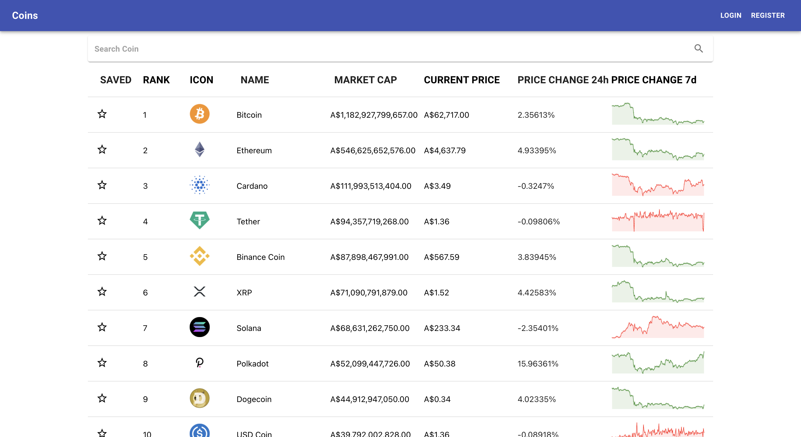

## Code Challenge

Coin
An application used to display the cryptocurrency data based on user preference, built with React, Redux, JavaScript, and CSS.

## Project Status

This project is currently in development and the code tesing is still on the way.
Only the following basic functionality has been implemented.

- Fetch cryptocurrencies sorted by market cap from a public API and show it as a list
- The list allows to be sorted by name, market cap and also allows to be searched by name.
- User registration and login

## Project Screen Shot

## Installation and Setup Instructions

Clone down this repository. You will need `node` and `npm` installed globally on your machine.  

Installation:

`npm install`  

To Run Test Suite:  

`npm test`  

To Start Server:

`npm start`  

To Visit App:

`localhost:3000/`  

## Incoming Feature

- Save coin into user watchlist (login required)
- Code testing
